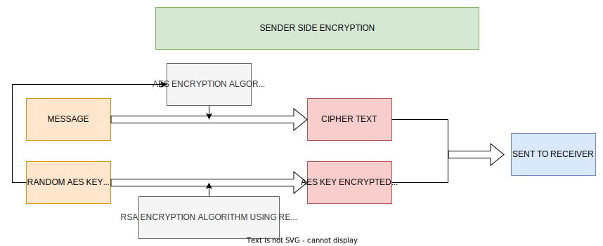
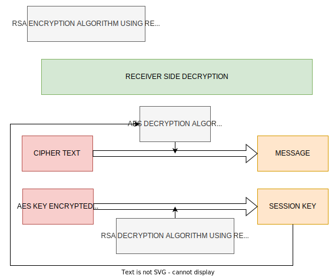

# Java project for 18ITGC0

## Hybrid Encryption

### Commands:

- `keygen`: Generates public/private key pair
- `add <name> <public key filepath>`: Add public key of other users
- `encrypt <name> <message file path>`: Encrypt message using public key of other user. Generates two files - sessionkey and cipher
- `decrypt <session key file path> <cipher file path>`: Decrypts encrypted message using the private key created in keygen command. Generates decipher file.

### Block diagrams

#### Sender side

#### Receiver side

More information available [here](https://drive.google.com/file/d/12jGGVieTTKgdCCg33PS7k7_2gq0_DwuX/view?usp=sharing)
